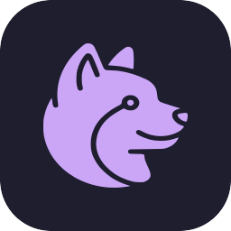

#  Mocha Framework

**TypeScript que compila pra Qt/QML nativo.** Zero bridge manual. Escreva `.qml.ts`, rode como app desktop com QML real e MochaDS (117 componentes prontos).

---

## O que é

Mocha é um **framework full-stack TypeScript** para construir aplicações Qt desktop. Você escreve código TypeScript com decorators familiares (`@QMLComponent`, `@qproperty`), usa QML inline via tagged template literals, e o framework faz o resto:

- **`@mocha/core`** — `QObject`, `QProperty<T>`, `Signal`, `effect()` — sistema reativo inspirado em Vue/Solid
- **`@mocha/qml`** — `runApp()`, `@QMLComponent`, `qml\`...\`` — QML como parte do TypeScript
- **`@mocha/native`** — bridge napi-rs que conecta Node.js (V8) ao Qt C++ real, com QQmlPropertyMap pra binding automático
- **MochaDS** — design system com 117 componentes QML prontos (Button, Card, Modal, TextField, Switch, Toast, etc.)
- **VSCode Extension** — IntelliSense, debug adapter com breakpoints funcionais, QObject Inspector

### Não é mais um "escrito do zero". É TypeScript rodando Qt de verdade.

---

## Arquitetura

```
┌─────────────────────────────────────────────┐
│  Seu código TypeScript                      │
│  @QMLComponent + @qproperty + qml`...`      │
├─────────────────────────────────────────────┤
│  @mocha/qml     │  runApp(), generateQML    │
│  @mocha/core    │  QObject, QProperty<T>    │
├─────────────────────────────────────────────┤
│  @mocha/native  │  napi-rs bridge           │
│  (C++ + Rust)   │  QQmlPropertyMap          │
├─────────────────────────────────────────────┤
│  Qt 6           │  QGuiApplication          │
│                 │  QQmlApplicationEngine     │
├─────────────────────────────────────────────┤
│  MochaDS        │  117 componentes QML      │
│  design-system/ │  Button, Card, Modal, ... │
└─────────────────────────────────────────────┘
```

Fluxo: **TS class → decorator metadata → QObject proxy → bridge C++ → Qt render → QML window**

---

## Estrutura do Projeto

```
mocha-framework/
├── packages/
│   ├── core/          # @mocha/core — QObject, QProperty, Signal, reactivity
│   ├── qml/           # @mocha/qml — runApp, QMLComponent, QML generation
│   ├── native/        # @mocha/native — napi-rs + Qt C++ bridge
│   ├── shared/        # Logger, utilities
│   ├── kit/           # CLI tools
│   ├── cli/           # Project scaffolding
│   └── testkit/       # Test runners for QML apps
├── design-system/
│   └── MochaDS/       # 117 componentes QML (.qml)
├── vscode-extension/  # VSCode extension (QML IntelliSense, Debug)
├── examples/
│   └── mocha-ds/      # Playground moderno com MochaDS
└── docs/              # Quickstart por plataforma
```

---

## Comece Aqui

| Sistema | Guia |
|---|---|
| 🐧 **Arch Linux** | [docs/quickstart-linux.md](docs/quickstart-linux.md) |
| 🐧 **Ubuntu / Debian** | [docs/quickstart-linux.md](docs/quickstart-linux.md) |
| 🍎 **macOS** | [docs/quickstart-macos.md](docs/quickstart-macos.md) |
| 🪟 **Windows** | [docs/quickstart-windows.md](docs/quickstart-windows.md) |

---

## Exemplo Mínimo

```typescript
// src/index.ts
import { QObject, QProperty, qproperty } from "@mocha/core";
import { QMLComponent, qml, runApp } from "@mocha/qml";

@QMLComponent({
  qml: qml`
    import QtQuick
    import QtQuick.Controls

    ApplicationWindow {
      visible: true
      width: 400; height: 300
      color: "#1e1e2e"

      Column {
        anchors.centerIn: parent
        spacing: 16

        Text {
          text: controller.message
          color: "#cdd6f4"
          font.pixelSize: 24
        }

        Button {
          text: "Click me"
          onClicked: controller.sayHello()
        }
      }
    }
  `,
})
class HelloController extends QObject {
  @qproperty message = new QProperty("Hello Mocha!");

  sayHello(): void {
    this.message.value = "Clicked! Count: " + (++this.clicks);
  }

  private clicks = 0;
}

runApp(HelloController);
```

---

## Features

- **Zero boilerplate** — `runApp(MyController)` e pronto
- **Reativo** — `QProperty<T>` + `effect()` = reatividade automática no QML
- **Bridge nativo** — QQmlPropertyMap → `valueChanged(key)` → QML reavalia bindings
- **117 componentes MochaDS** — Catppuccin theme, Lucide icons, responsivo
- **Debug adapter** — breakpoints no TS que param o Qt, variáveis no painel, QML tree
- **Entry point automático** — F5 detecta `src/index.ts` ou `index.ts`
- **Porta aleatória** — sem conflito entre sessões de debug

---

## Desenvolvimento

```bash
# Instalar dependências
npm install

# Build todos os packages TypeScript
npm run build

# Build binário nativo (Linux, macOS, Windows)
cd packages/native && npx napi build --platform --release && cd ../..

# Rodar exemplo
npx tsx examples/mocha-ds/index.ts

# Rodar testes
npx vitest run
```
